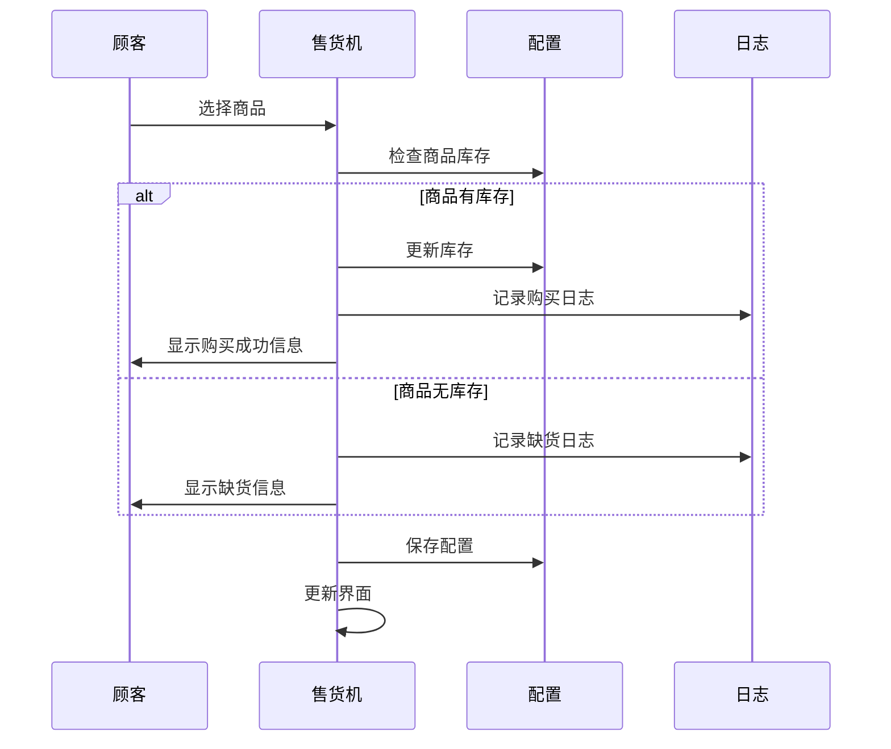

## 注意事项
- 本项目为 Swing 使用 IDEA Swing UI Designer 开发，请使用 IDEA 开发本项目。

## 流程图



## 项目结构
```text
VendingMachine
└── lib # 依赖库
└── src
├── data
│ ├── Config.java # 配置文件相关类
│ ├── Log.java # 日志记录相关类
│ ├── Page.java # 日志记录相关类
│ ├── Product.java # 商品信息相关类
│ ├── ProductMaintenanceTableModel.java # 商品维护 TableModel
│ ├── SalesLogTableModel.java # 销售日志 TableModel
│ └── VendingTableModel.java # 销售界面 TableModel
├── Main.java # 程序入口
├── ui
│ ├── AddProduct.form
│ ├── AddProduct.java # 添加商品界面
│ ├── Login.form
│ ├── Login.java # 登录界面
│ ├── Setting.form
│ ├── Setting.java # 设置界面
│ ├── Vending.form
│ └── Vending.java # 售货机界面
└── util
├── Const.java # 常量定义
├── FileUtil.java # 文件操作工具类
└── JsonUtil.java # JSON操作工具类
```

